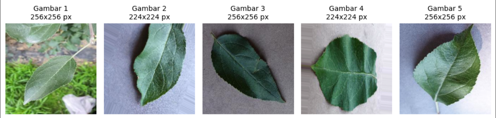

# AgriCurify-ML

AgriCurify, a user-friendly machine learning-powered mobile application, helps farmers quickly diagnose plant diseases using their smartphone cameras. It provides easy-to-follow prevention and treatment guides to support farmers in managing plant health and boosting crop productivity.
Apart from that, this application will also provide advice on the treatment needed to overcome detected plant diseases. The initial release includes three main features: 
1. **Apple Leaf Disease Prediction**
2. **Grape Leaf Disease Prediction**
3. **Tomato Leaf Disease Prediction**

## Machine Learning Deliverables
- Gathering available datasets  
- Completing the advanced data preprocessing  
- Developing and evaluating a baseline model  
- Saving the baseline model, advanced data preprocessing, and model optimization

## Dataset Source
- Apple: https://www.kaggle.com/datasets/muhammadraihanf12/agricurify-apple
- Grape: https://www.kaggle.com/datasets/muhammadraihanf12/agricurify-grape
- Tomato: https://www.kaggle.com/datasets/muhammadraihanf12/agricurify-tomatov2 

### Preview Images

## Documentation
1. Clone this github repository or download zip and extract it 

   

2. Open the ipynb file contained in each folder using google colaboratory
3. Download the dataset
5. Making a load data from kaggle and using api kaggle
6. Run the code and save the model in .h5 form
